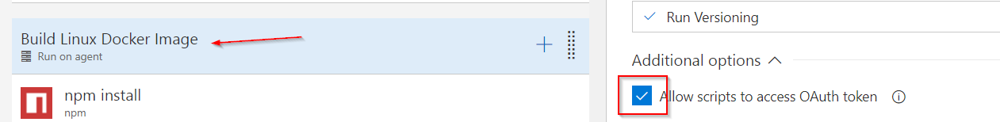

# Containerizing .NET Core Console

## Multi-Stage Builds

It's important to keep the image size down.

Use multiple `FROM` statements in the Dockerfile to represent a new stage in the build.

Each stage copys only the required artifacts leaving behind what is not needed.

For every project that is needed for the build, add a `COPY` command.

```
ARG BuildConfiguration=Debug
ARG SYSTEM_ACCESSTOKEN=myPAT
ARG ASSEMBLY_VERSION=0.1
ARG FILE_VERSION=0.1.0.0

FROM microsoft/dotnet:2.0-runtime AS base
WORKDIR /app

FROM microsoft/dotnet:2.0-sdk AS build
ARG BuildConfiguration
ARG SYSTEM_ACCESSTOKEN
ARG ASSEMBLY_VERSION
ENV BuildConfiguration=$BuildConfiguration `
    ASSEMBLY_VERSION=$ASSEMBLY_VERSION `    
    SYSTEM_ACCESSTOKEN=$SYSTEM_ACCESSTOKEN
WORKDIR /build
COPY *.sln ./
COPY src/ServiceA.Business/ServiceA.Business.csproj src/ServiceA.Business/
COPY src/ServiceA.Service/ServiceA.Service.csproj src/ServiceA.Service/
COPY src/ServiceA.Service.Hosting/ServiceA.Service.Hosting.csproj src/ServiceA.Service.Hosting/
COPY src/ServiceA.Service.Hosting.Abstractions/ServiceA.Service.Hosting.Abstractions.csproj src/ServiceA.Service.Hosting.Abstractions/
RUN dotnet restore
COPY . .
WORKDIR /build/src/ServiceA.Service
RUN dotnet build --no-restore -c $BuildConfiguration -o /app /p:"Version=$ASSEMBLY_VERSION"

FROM build AS publish
RUN dotnet publish --no-restore -c $BuildConfiguration -o /app /p:"Version=$ASSEMBLY_VERSION"
```

## Arguments and Environment Variables

Use the keyword `ARG` to define arguments that you want configure. 

`ARG` variables declared before `FROM` run outside of a build stage and can be used in any instruction. These can be override via VSTS such as build configuration.

## Connecting to Private NuGet Feeds

When using a private feed, an intermediary script will be needed to add VSTS PAT to the NuGet.config file. At this time, running docker-compose from VSTS will not authenticate the dotnet restore command by default. Enable the `Allow scripts to access OAuth token` in order to use the `SYSTEM_ACCESSTOKEN` variable.



Locally you can enter your own VSTS PAT token in the NuGet.config file. Do not check this in. This should be used only for testing locally.

```
<packageSourceCredentials>
    <LraFeed>
        <add key="Username" value="user@lranet.com" />
        <add key="Password" value="..." />
    </LraFeed>
</packageSourceCredentials>
```

---
[lab](00-lab-environment.md) > [setup](01-setup.md) > [docker](02-docker.md) > [cicd](03-cicd.md) > [cofig](04-configuration.md) > [logging](05-logging.md) > [readiness](06-readiness.md)