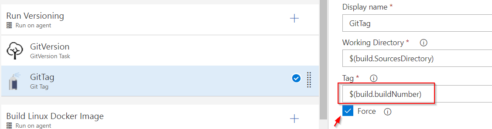
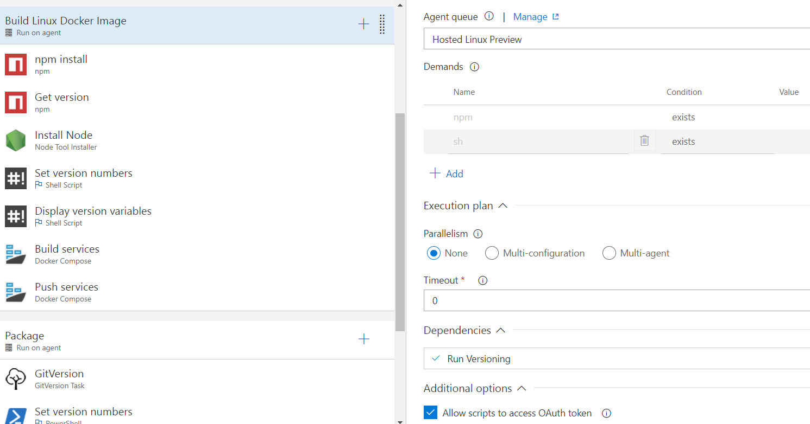
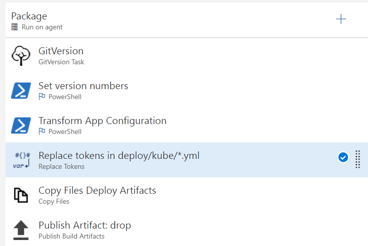

# .NET Core Docker Container CI/CD using VSTS

This lab shows an approach using VSTS to build and deploy a docker container to AKS.

In order to build Linux containers, use a `Hosted Linux` agent or a private one.

## CI - Continous Integration

### Configuration

Confirm that the `Project Collection Build Service` has the following permissions to the repository:

1. Contribute - Allow
2. Create Tag - Allow
3. Force push - Allow

### Pull Requests

Use a gated build to restore/build/test the application. Enforce this build as part of the pull request process.

### CI Phases

In this example 3 phases are setup in order to run the full CI process. This will depend on the CI approach that best meets your application's needs.

1. Run versioninig
2. Build Linux Docker image
3. Package

Sharing variables across phases is currently **NOT supported** in VSTS using the UI designer.

#### Run versioning phase

Use a windows agent to run `GitVersion` and `GitTag`. This will auto-calculate given the configuration specified in the `GitVersion.yml` or use the latest repository tag.



#### Build Linux Docker image phase

Use a linux agent to run `Docker Compose` to `build` and `push` the image.

1. Set version number in variables
2. Build docker compose
    * Pass environment variables such as `BuildConfiguration`
3. Push images to Azure container registry



#### Package Phase

The last phase is to run any additional configuration such as transforming application configuration files or replacing kubernetes yaml variables. This phase will bundle only what is needed to run a release such as the application configuration files, kubernetes yaml, and ARM templates.



## CD - Continuous Delivery

Steps:

1. Set any kubernetes labels
    * Consider labels that are environment specific and are useful for troubleshooting.
    * `$(Release.ReleaseName)_$(Release.ReleaseId)` can be used to represent the release that maps to the `kubectl apply`.
2. Replace environment specific application configuration
    * Configure application secrets and other variables specific for the environment.
3. Replace environment specific kubernetes yml.
    * Replace kubernetes yml place holders such as labels and ACR repository url.
4. Force create of application's kubernetes config map. (Delete/Create)

    ```
    kubectl delete configmap lraimageprocessorservice-config

    kubectl create configmap lraimageprocessorservice-config --from-file=$(System.DefaultWorkingDirectory)/app/drop/deploy/kube/config/appsettings.json
    ```

5. Force create of application's kubernetes secrets. (Delete/Create)

    ```
    kubectl delete secret lraimageprocessorservice-secrets

    kubectl create secret generic lraimageprocessorservice-secrets --from-file=$(System.DefaultWorkingDirectory)/app/drop/deploy/kube/config/appsettings.secrets.json
    ```

6. Apply the application kubernetes yml file.

    ```
    kubectl apply -f $(System.DefaultWorkingDirectory)/app/drop/deploy/kube/kube-deploy.yml
    ```

7. Sanity check

    ```
    kubectl describe statefulset lraimageprocessorservice
    ```


---
[lab](00-lab-environment.md) > [setup](01-setup.md) > [docker](02-docker.md) > [cicd](03-cicd.md) > [cofig](04-configuration.md) > [logging](05-logging.md) > [readiness](06-readiness.md)