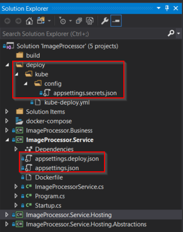

# Secrets and ConfigMaps

This sample use .NET Core Configuration using JSON files.

## Application configuration

```
public IServiceHostBuilder UseConfiguration(string[] args)
{
    if (args == null)
    {
        throw new ArgumentNullException(nameof(args));
    }
    string baseConfigPath = Directory.GetCurrentDirectory();
    string applicationName = Assembly.GetEntryAssembly().GetName().Name;

    _configuration = new ConfigurationBuilder()
        .SetBasePath(baseConfigPath)
        .AddCommandLine(args)
        .AddEnvironmentVariables()
        .AddJsonFile("appsettings.json", true, true)
        .AddJsonFile($"/etc/{applicationName}/local/appsettings.json", true, true)
        .AddJsonFile($"/etc/{applicationName}/localsecrets/appsettings.secrets.json", true, true)
        .AddJsonFile($"/etc/{applicationName}/appsettings.json", true, true)
        .Build();
    _services.AddSingleton(_configuration);
    return this;
}
```

1. Use appsettings.json to deploy application configuration. 
2. Maintain a deployable configuration file - [appsettings.deploy.json](../../app/src/ImageProcessor.Service/appsettings.deploy.json)
    * Use token for settings that are environment specific
3. Maintain secrets in a separate file - [appsettings.secrets.json](../../app/deploy/kube/config/appsettings.secrets.json)
    * Use token for settings that are environment specific

*NOTE: Currently sending a singal when a config map changes isn't supported
delete/recreate and redeploy in order to maintain a consistent deployment*



## Create Config Map

Config map can be mounted as a directory on a pod and the files that it contains are available in the file system. These settings will contain the deployed version of [appsettings.deploy.json](../../app/src/ImageProcessor.Service/appsettings.deploy.json).

```
kubectl create configmap lraimageprocessorservice-config --from-file=deploy/kube/config/appsettings.json
```

## Using config map

```
spec:
      containers:
      - name: lraimageprocessorservice
        volumeMounts:
        - name: lraimageprocessorservice-config
          mountPath: /etc/lra.ImageProcessor.Service/local
      volumes:
      - name: lraimageprocessorservice-config
        configMap:
          name: lraimageprocessorservice-config
          optional: false
```

## Create Secret

Secrets can be mounted as a directory on a pod and the files that it contains are available in the file system. This can be used for app settings files and certificates.

```
kubectl create secret generic lraimageprocessorservice-secrets --from-file=deploy/kube/config/appsettings.secrets.json
```

## Using the secret

```
spec:    
      containers:
      - name: lraimageprocessorservice        
        volumeMounts:
        - name: lraimageprocessorservice-secrets
          mountPath: /etc/lra.ImageProcessor.Service/localsecrets
      volumes:      
      - name: lraimageprocessorservice-secrets
        secret:
          secretName: lraimageprocessorservice-secrets
          optional: false
```

## View pod appsettings.json

```
kubectl exec -it lraimageprocessorservice-0 -- /bin/bash

cd /etc/lra.ImageProcessor.Service/local
cat appsettings.json

cd /etc/lra.ImageProcessor.Service/localsecrets
cat appsettings.secrets.json
```

---
[lab](00-lab-environment.md) > [setup](01-setup.md) > [docker](02-docker.md) > [cicd](03-cicd.md) > [cofig](04-configuration.md) > [logging](05-logging.md) > [readiness](06-readiness.md)