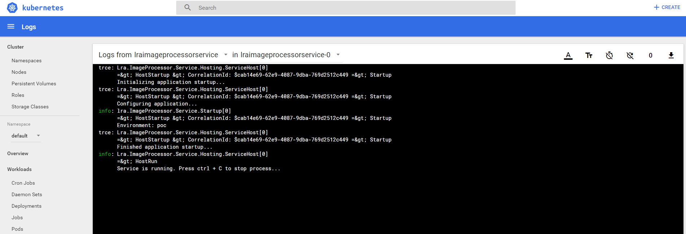
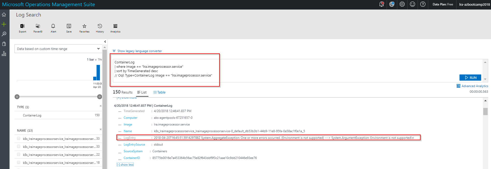

# Monitoring and Logging

There are a number of monitoring solutions available today.

* Datadog
* Sysdig
* Elastic Stack (Elasticsearch, Logstash & Kibana)
* Splunk
* Operations Management Suite (OMS)
* Prometheus and Grafana
* CoScale

For the purposes of this lab we will be focusing in on OMS.

## Setup

see [cluster monitoring](../infra-labs/09-monitoring.md) for full setup instructions.

## View logs via Kubernetes UI




## View logs via Operations Management Suite (OMS)

1. OMS configuration is required for this.
2. Application should be logging to stdout.



### Log Analytics Queries

#### Application Logs
```
ContainerLog
| where LogEntrySource == "stdout"
| where Image == "lra.imageprocessor.service"
| sort by TimeGenerated desc
// Oql: Type=ContainerLog LogEntrySource=stdout
```

#### Pod Events
```
search in (KubeEvents_CL) Name_s == "lraimageprocessorservice-0" and Type_s == "Warning"
| project TimeGenerated, Namespace_s, Name_s, Reason_s, Type_s, Message
| render table
// Oql: Type=KubeEvents_CL Name_s == "lraimageprocessorservice-0" and Type_s == "Warning" | select TimeGenerated, Namespace_s, Name_s, Reason_s, Type_s, Message | display table
```

---
[lab](00-lab-environment.md) > [setup](01-setup.md) > [docker](02-docker.md) > [cicd](03-cicd.md) > [cofig](04-configuration.md) > [logging](05-logging.md) > [readiness](06-readiness.md)