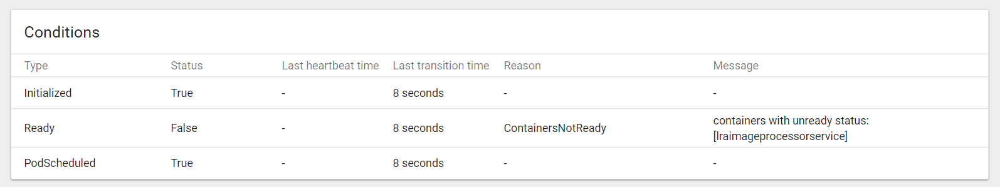

# Configure Readiness Probes

Readiness and liveness probes can be configured for Kubernetes deployments to:

* Enable zero downtime deploys
* Ensure that failed containers are automatically restarted
* Prevent HTTP requests until the application is ready

## Readiness Probes

With readiness probes, Kubernetes will not send traffic to a pod until the probe is successful. When updating a deployment, it will also leave old replica(s) running until probes have been successful on new replica. That means that if your new pods are broken in some way, they’ll never see traffic, your old pods will continue to serve all traffic for the deployment.

## Liveness Probes

Liveness probes will attempt to restart a pod if it fails.

### Settings

* `initialDelaySeconds` How long to wait before sending a probe after a container starts.
* `timeoutSeconds` How long a request can take to respond before it’s considered a failure.
* `periodSeconds` How often a probe will be sent

### Probes for HTTP Services

```
readinessProbe:
  httpGet:
    path: /monitoring/alive
    port: 3401
  initialDelaySeconds: 5
  timeoutSeconds: 1
  periodSeconds: 15
```

### Probes for non-HTTPServices

```
readinessProbe:
  exec:
    command:
        - test
        - '`find . -name Status.txt`'
  initialDelaySeconds: 5
  periodSeconds: 15
```          

### Get Ready Status via Kubectl

```
kubectl get pod lraimageprocessorservice-0
NAME                         READY     STATUS    RESTARTS   AGE
lraimageprocessorservice-0   0/1       Running   0          6s

kubectl get pod lraimageprocessorservice-0
NAME                         READY     STATUS    RESTARTS   AGE
lraimageprocessorservice-0   1/1       Running   0          1m

kubectl get pod lraimageprocessorservice-0
NAME                         READY     STATUS        RESTARTS   AGE
lraimageprocessorservice-0   1/1       Terminating   0          3m

kubectl get pod lraimageprocessorservice-0
NAME                         READY     STATUS              RESTARTS   AGE
lraimageprocessorservice-0   0/1       ContainerCreating   0          2s
```

### Get Ready Status via Kubernetes UI



---
[lab](00-lab-environment.md) > [setup](01-setup.md) > [docker](02-docker.md) > [cicd](03-cicd.md) > [cofig](04-configuration.md) > [logging](05-logging.md) > [readiness](06-readiness.md)