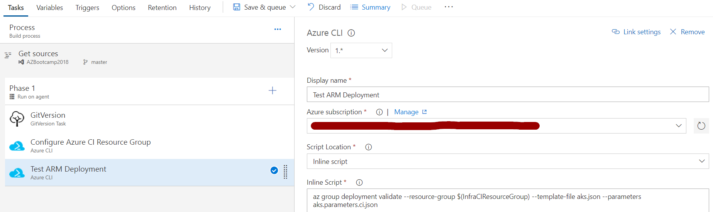
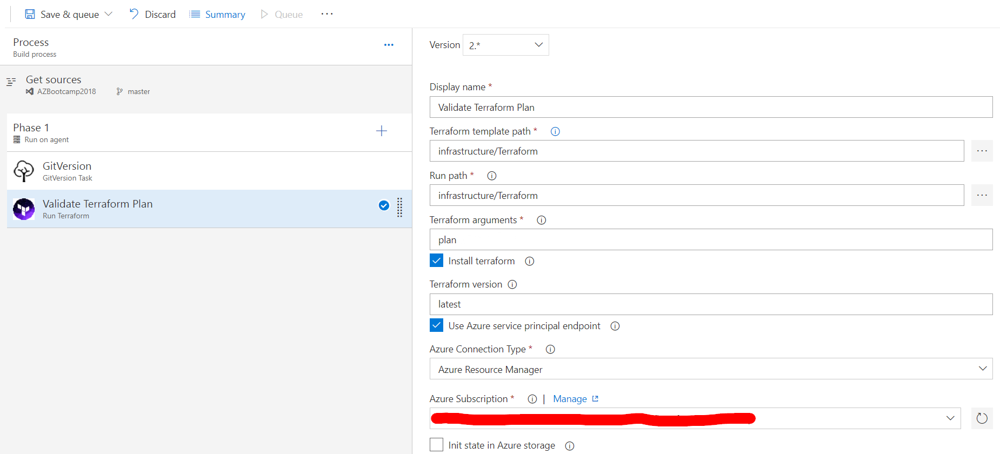
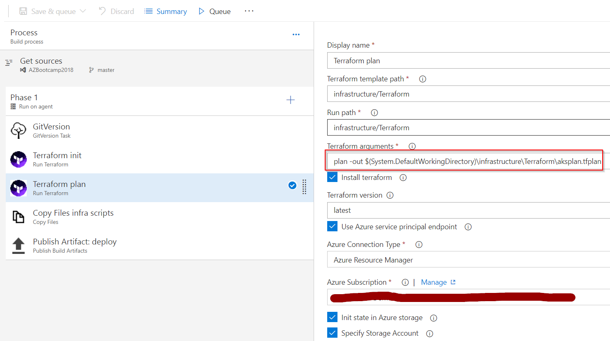
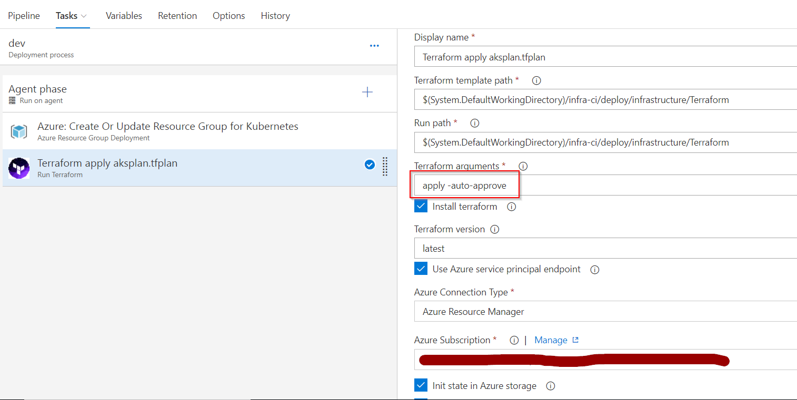

# Continuous Integration and Continuous Deployment using VSTS
VSTS provides a platform managing the infrastructure as code and automating the deployment of resources.

## ARM

* Gated - Verify the ARM file

* CI - Package artifacts such as Json files, parameter files, and additional scripts.
* Release

## Terraform

Additional guidance for automation with Terraform - https://www.terraform.io/guides/running-terraform-in-automation.html.

* Gated - Verify the plan

* CI - Build the release plan and copy artifacts

* Release - Apply the plan and auto-approve changes

---
[1](00-lab-environment.md) > [2](01-setup-aks.md) > [3](02-setup-terraform.md) > [4](03-create-aks-cluster-cli.md) > [5](04-create-aks-cluster-arm.md) > [6](05-create-aks-cluster-tf.md) > [7](06-cicd.md) > [8](07-kubernetes-ui.md) > [9](08-container-registry.md) > [10](09-monitoring.md) > [11](10-cluster-scaling.md) > [12](11-cluster-upgrading.md) > [13](12-advanced.md)