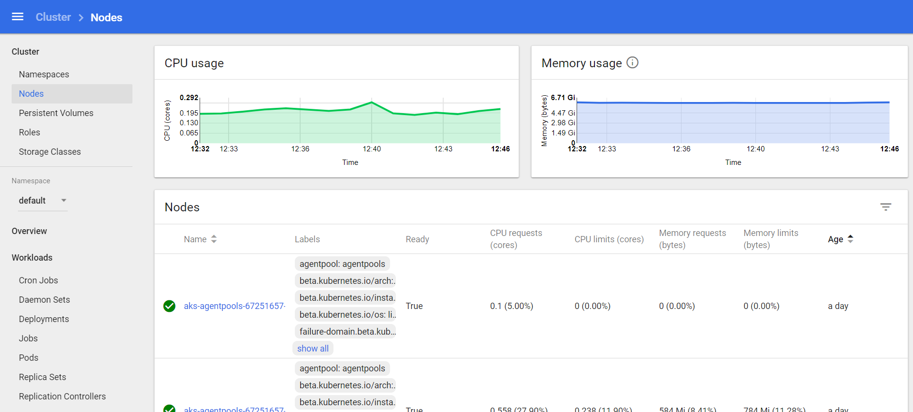

# Kubernetes Dashboard
The Kubernetes dashboard is a web ui that lets you view, monitor, and troubleshoot Kubernetes resources.

The Kubernetes dashboard is a secured endpoint and can only be accessed using the SSH keys for the cluster. 

## Accessing The Dashboard UI
We'll be using `kubectl` to setup a secure connection to the UI.

After the cluster and its resources are created, get the kube config in order to start executing commands against the cluster.

* Confirm current cluster context `kubectl config current-context`
* Set context to the correct cluster `kubectl config use-context AZBootCamp2018k8s`
* Run ```kubectl proxy```
* This creates a local proxy to 127.0.0.1:8001
    * If port 8001 is in use, use the ```--port=8081``` switch.
* Open a web browser and point to: http://127.0.0.1:8001/api/v1/proxy/namespaces/kube-system/services/kubernetes-dashboard/#!/cluster?namespace=default

## Explore Kubernetes Dashboard

 

 
---
[1](00-lab-environment.md) > [2](01-setup-aks.md) > [3](02-setup-terraform.md) > [4](03-create-aks-cluster-cli.md) > [5](04-create-aks-cluster-arm.md) > [6](05-create-aks-cluster-tf.md) > [7](06-cicd.md) > [8](07-kubernetes-ui.md) > [9](08-container-registry.md) > [10](09-monitoring.md) > [11](10-cluster-scaling.md) > [12](11-cluster-upgrading.md) > [13](12-advanced.md)